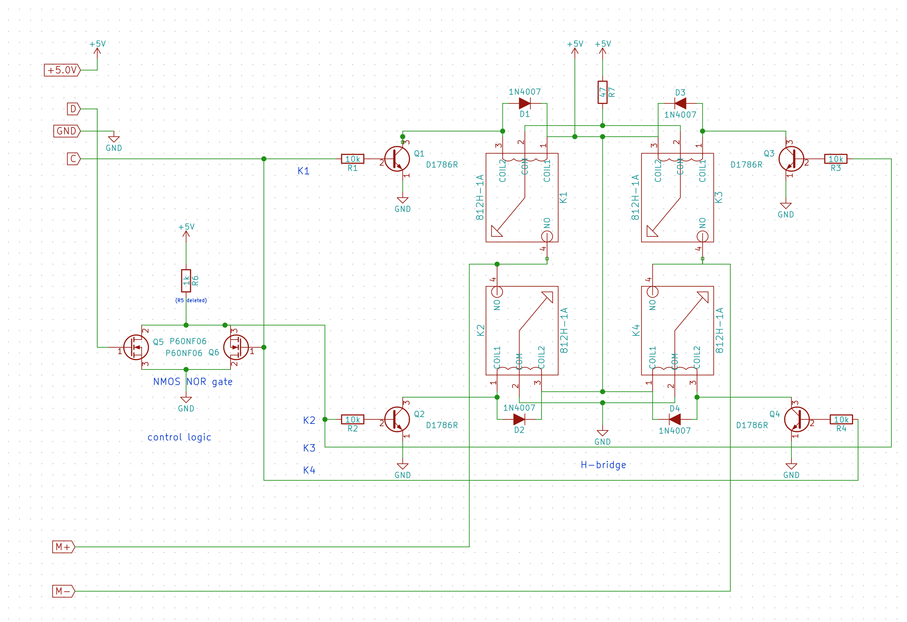

# rp-hbridge

Example of schematic for an H-bridge circuit built with salvaged components to
control a CD/DVD tray motor (in both directions) using only two Raspberry Pi's GPIO pins

Open the schematic with [KiCad](http://kicad-pcb.org). Includes symbols for the 812H-1A SPST relays and a motor.

Wire the D and C inputs to GPIO outputs, control as follows:

| D | C | operation | h-bridge K1/K2/K3/K4 |
| --- | --- | --------- | -------------------- |
| 0 | 0 | forward   | 0110 |
| 0 | 1 | reverse   | 1001 |
| 1 | 0 | coast     | 0000 |
| 1 | 1 | reverse   | 1001 |

Braking (0101 or 1010, connecting both sides of the motor to GND or power) is not supported by the
included control logic (a simple NOR gate), but can be achieved by wiring all of the four H-bridge
inputs K1, K2, K3, and K4 directly to the GPIO output pins and controlling appropriately, but beware
of short circuits.

For details see:

* [article: Building an H-Bridge from a salvaged Uninterruptible Power Supply](https://medium.com/@rxseger/building-an-h-bridge-from-a-salvaged-uninterruptible-power-supply-ab1576ec313f)
* [video demo: RPi CD/DVD Tray GPIO H-Bridge](https://vimeo.com/181584051)

screenshot:

